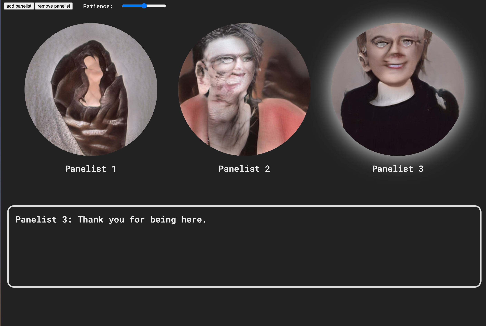

# 2019 Meta-Panel

## Live Demo

Live demo here: [https://edwardwolcher.github.io/2019-MetaPanel/](https://edwardwolcher.github.io/2019-MetaPanel/) (works in chrome, but not other browsers, based on my testing)

## Overview

This project is an artistic experiment in an autonomous generative textual work using NLP. It is based on the ubiquitous model of the "panel discussion", and presents a modular algorithmic panel which can be expanded and modulated by a user. The result is a wash of semi-coherent conversation that emulates the most frustrating qualities of actual panel discussions while providing a critical lens onto the form and content of public intellectual discussion.

The text in the model is generated from a GPT2 model fine tuned on the transcripts of public lecture programs at the organization [Town Hall Seattle](townhallseattle.org), my former employer where I served as Curator of Lectures. The transcripts that trained this model come from my final full year in that curatorial role: 2019. They represent a range of political, social, scientific and cultural topics and provide a window into the general concerns of the bourgeois liberal milieu in that odd moment prior to Covid and the presidential election of 2020. They also, in some sense, represent my own collective unconscious as the totality of voices that I was ultimately responsible for elevating.

The images used in the work are generated from a partially trained GAN using the [runway.ml](http://runwayml.com) service. They are based on the headshots of the same speakers who trained the text trained against a general face-generating model. The incomplete training process results in a set of surreal half-formed faces who show a glimpse into the latent space of a "panelist headshot". 

The text-to-speech voices are basic speech synthesizers implemented using the [p5.speech](https://idmnyu.github.io/p5.js-speech/) library. The piece overall makes liberal use of p5.js as a framework.

This is an experimental prototype that's part of a larger project I'm informally referring to as Culture Industry, which aims to develop a complex generative artwork based on the form and content of Town Hall Seattle's programming. This is also an experiment in automating my own past work and critically examining how and why automation could be applied to the realm of cultural curation. The file [culture_industry.md](culture_industry.md) has more information on the larger envisioned project.

## Code Explanation 

The code implementing the logic of the site and its UI is in the `script.js`file. The python script `process_topics.py` is a simple script to parse the large volume of generated text by topic into a JSON file that can be easily read by the Javascript program. Raw text from the gpt2 model is in the topics folder. Raw images from the GAN are in the images folder.

The site itself is still running a bit buggy and works best in Chrome. If the text appears stuck try adding or removing a panelist or reloading the page. 

